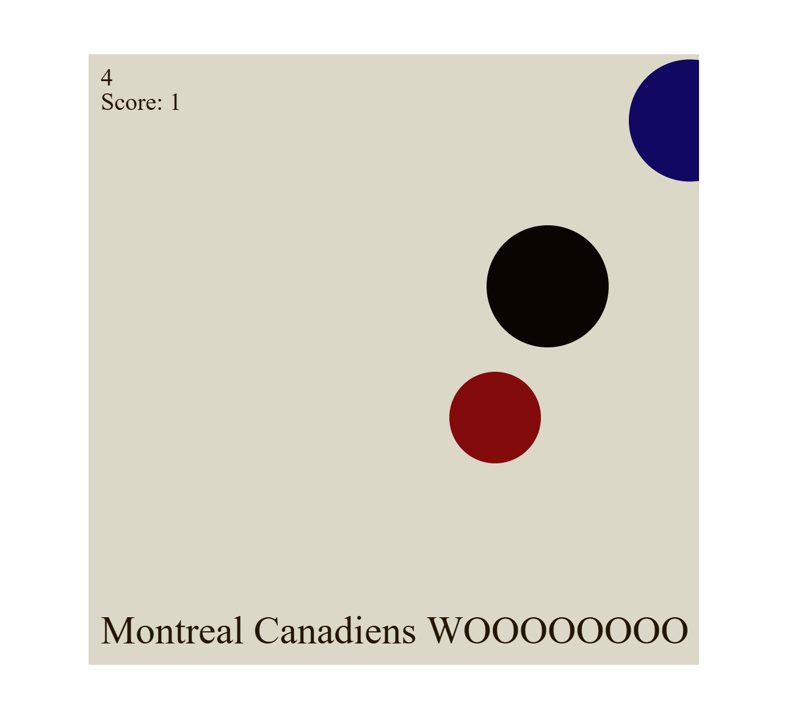
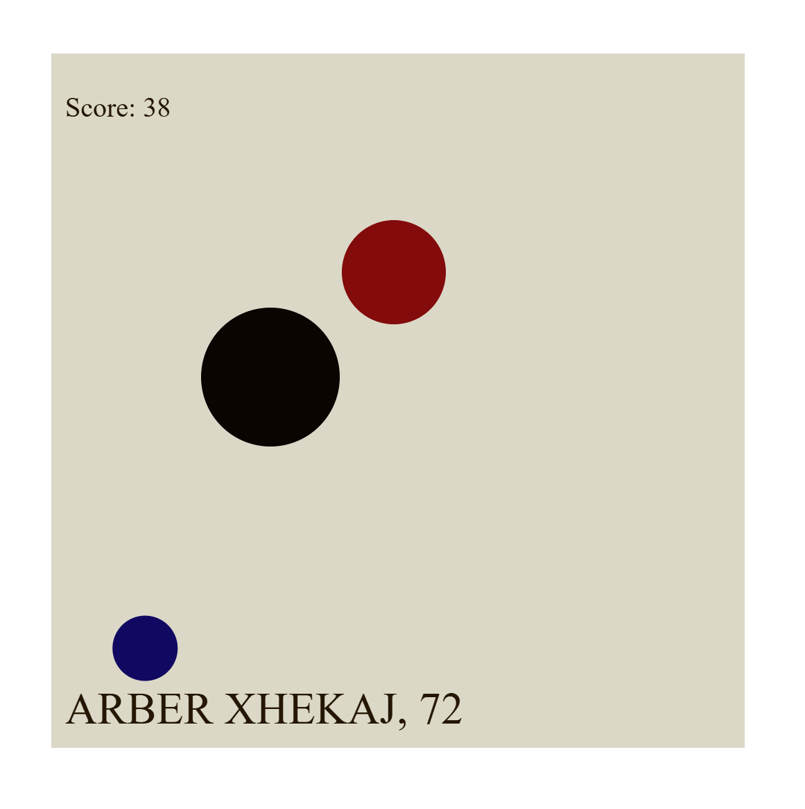

# TITLE OF PROJECT

Lucie Soussana

[View this project online](https://luciee246.github.io/cart253/topics/variation-jam/variations-menu/)

## Description

> *Hockey Master* is a simulator experience that allows the user to control a puck and push it to the goal.

> The experience is controlled via mouse movement, with the user moving the puck and getting it to goal, and you play for a duratino of 10 seconds.

> This project is heavily influenced by the Montreal Canadiens (the best team), have your sound on!

> Three variations:
> - Normal: Get the puck to the goal as many times as you can!
> - Shrink: The target will shrink over time until you get to it! No timer in this one.
> - Music will guide you: The target can only be found by listening to the music that plays louder when you get closer to it (hot/cold style)

## Screenshot(s)
> 
> 
> 

## Attribution

This bit should attribute any code, assets or other elements used taken from other sources. For example:

> - This project uses [p5.js](https://p5js.org).
> - This project is based on the disc master challenge we did in class.
> - https://freesound.org/

## License

> This project is licensed under a Creative Commons Attribution ([CC BY 4.0](https://creativecommons.org/licenses/by/4.0/deed.en)) license with the exception of libraries and other components with their own licenses.